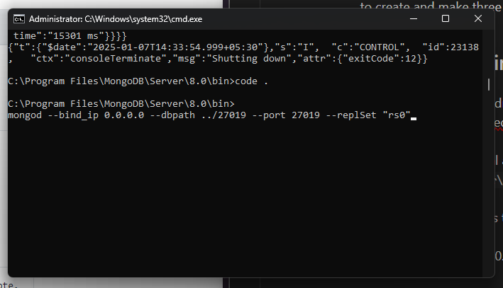
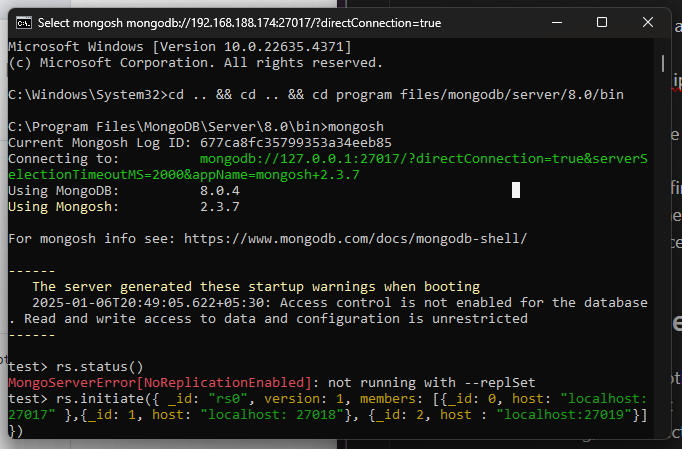
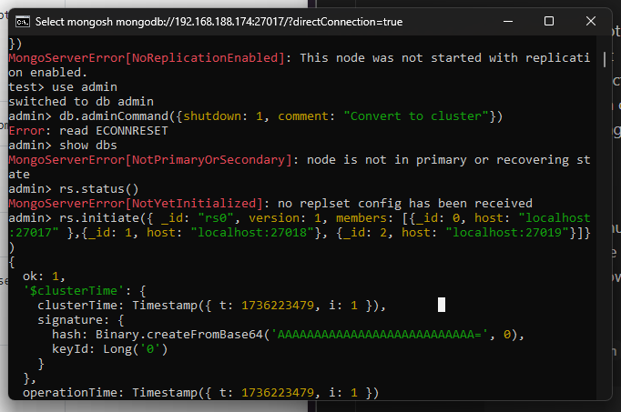
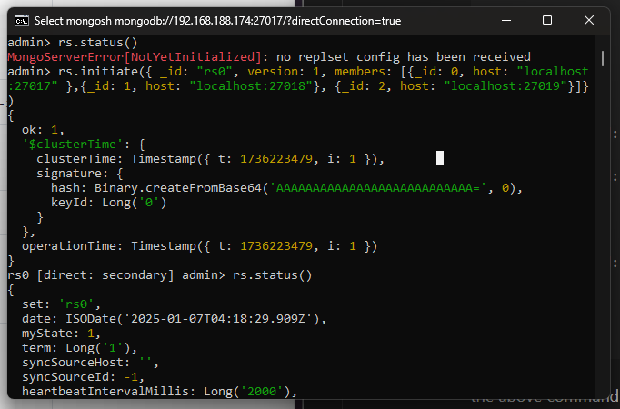
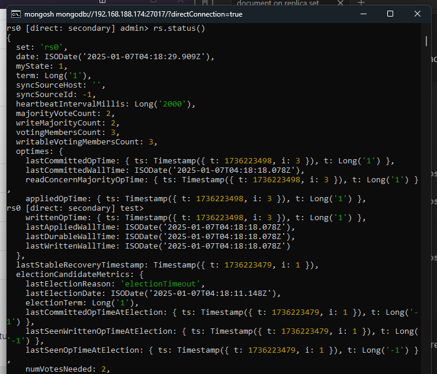
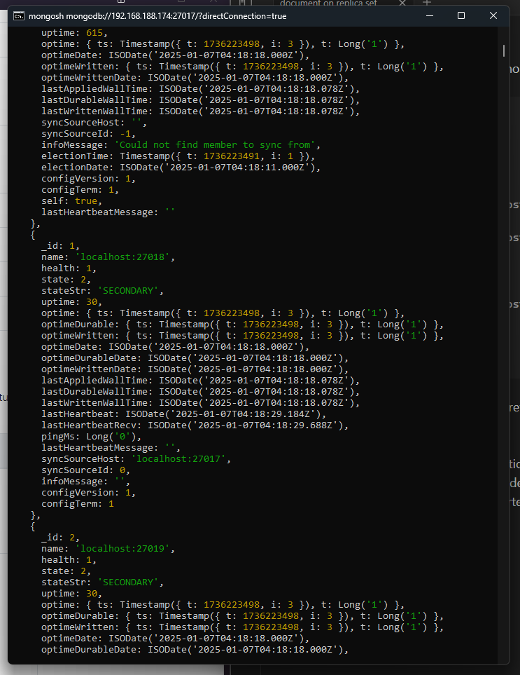
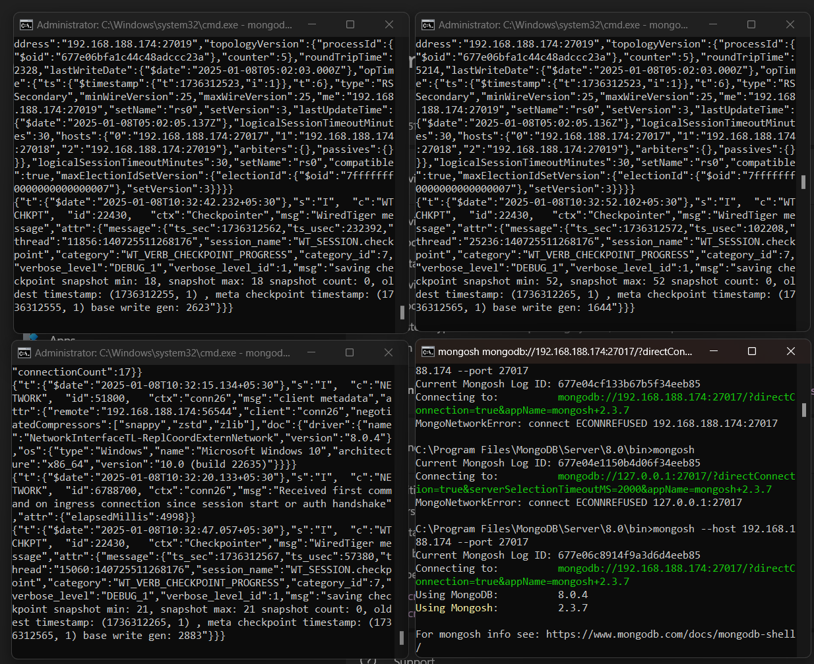

# Creating a MongoDB Replica Set on Windows

A MongoDB replica set allows for high availability and redundancy by replicating data across multiple database instances. This guide outlines the steps to set up a MongoDB replica set on a Windows machine.

---

## Prerequisites

- MongoDB installed on your system.
- Administrator privileges to execute commands.
- Basic knowledge of command-line operations.

---

## Step 1: Create Folders for Storage

1. Open **Command Prompt** with administrator privileges.
2. Navigate to the MongoDB installation directory, usually:
    
    ```
    cd "C:\Program Files\MongoDB\Server\<your_mongo_version>"
    ```
    
3. Create directories for each MongoDB instance:
    
    ```
    mkdir 27017 27018 27019
    ```
    

---

## Step 2: Configure MongoDB

1. Navigate to the `bin` directory:
    
    ```
    cd bin
    ```
    
2. Open the `mongod.cfg` file in a code editor and modify the following lines:
    
    ```yaml
    # Network interfaces
    net:
      port: 27017
      bindIp: 0.0.0.0
    
    # Replication
    replication:
      replSetName: "rs0"
    ```
    
3. Save the file and close the editor.

---

## Step 3: Run MongoDB Instances

1. Open three separate terminals with administrator privileges.
    
2. Start each MongoDB instance using the following commands:
    
    **Instance 1 (27017):**
    
    ```
    mongod --bind_ip 0.0.0.0 --dbpath ../27017 --port 27017 --replSet "rs0"
    ```
    
    **Instance 2 (27018):**
    
    ```
    mongod --bind_ip 0.0.0.0 --dbpath ../27018 --port 27018 --replSet "rs0"
    ```
    
    **Instance 3 (27019):**
    
    ```
    mongod --bind_ip 0.0.0.0 --dbpath ../27019 --port 27019 --replSet "rs0"
    ```
	
	

> **Note:** If you updated `mongod.cfg` as described earlier, the `--bind_ip` flag can be omitted.

---

## Step 4: Initialize the Replica Set

1. Open a new terminal and connect to the MongoDB instance on port 27017:
    
    ```
    mongosh
    ```
    
2. Check the replication status:
    
    ```
    rs.status()
    ```
    
    If replication is not enabled, you will see an error like `MongoServerError[NoReplicationEnabled]`.
	
	
	
    
3. Switch to the `admin` database:
    
    ```
    use admin
    ```
    
4. Shut down the database to convert it to a cluster:
    
    ```javascript
    db.adminCommand({
      shutdown: 1,
      comment: "Convert to cluster"
    });
    ```
    
5. Restart the database and initiate the replica set:
    
    ```javascript
    rs.initiate({
      _id: "rs0",
      members: [
        { _id: 0, host: "localhost:27017" },
        { _id: 1, host: "localhost:27018" },
        { _id: 2, host: "localhost:27019" }
      ]
    });
    ```
	
	
	
	
	
	
1. Verify the replica set initialization:
    
    ```
    rs.status()
    ```
	
	
	
	
	
	

---

## Step 5: Connect to MongoDB Instances

To interact with individual MongoDB instances, use the following commands:

**Instance 1:**

```bash
mongosh --port 27017
```

**Instance 2:**

```bash
mongosh --port 27018
```

**Instance 3:**

```bash
mongosh --port 27019
```



---

## Step 6: Connect to the Replica Set

1. Use `db.getMongo()` to verify the connection string for each instance.
2. To connect to the entire replica set, use the following URI in MongoDB Compass or your application:
    
    ```
    mongodb://localhost:27017,localhost:27018,localhost:27019/?replicaSet=rs0
    ```
    

---

## Additional Notes

- MongoDB creates a database only when data is written to it for the first time.
- Use `Ctrl + C` twice to stop an instance if needed.
- To ensure all instances are running as part of the replica set, use `rs.status()` in the primary node.
- Avoid stopping the primary node unless necessary, as it may affect the replica set operations.

With these steps, you have successfully set up a MongoDB replica set on your Windows machine!
