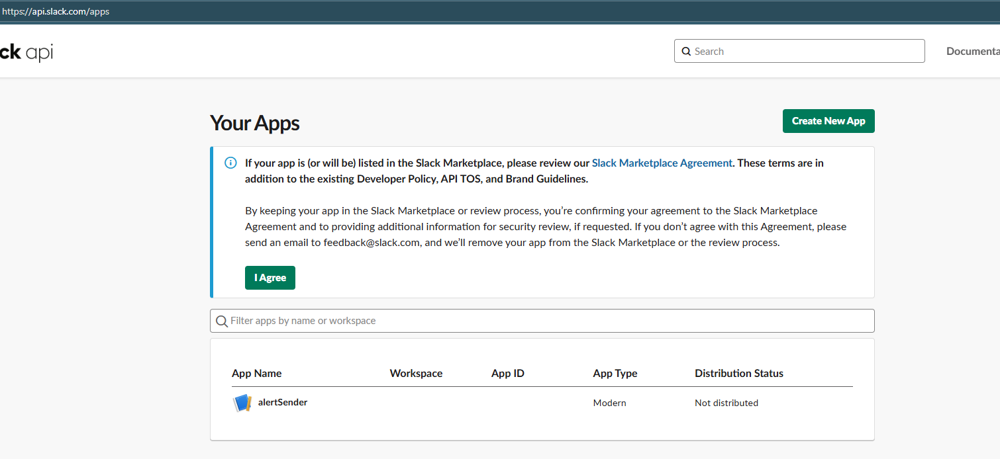
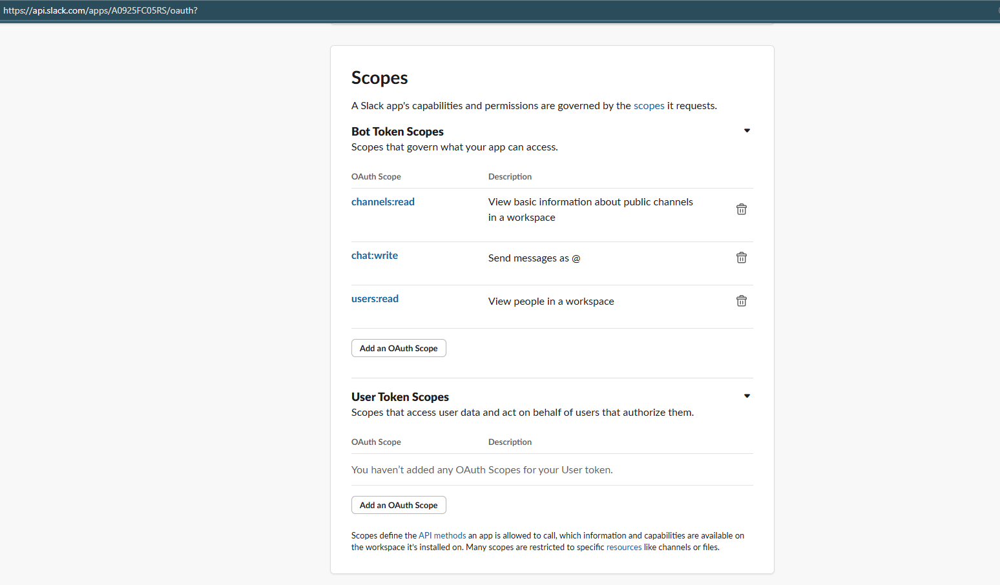
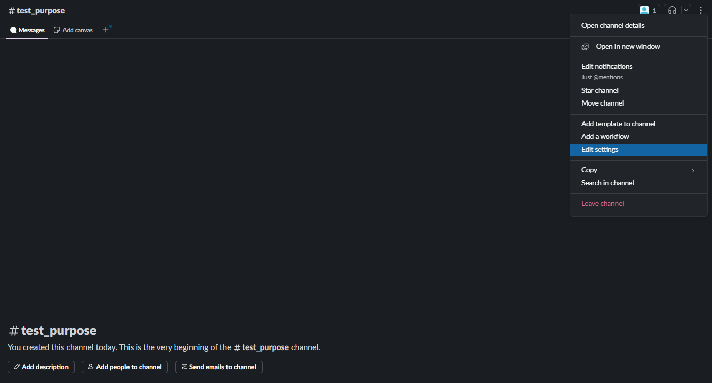
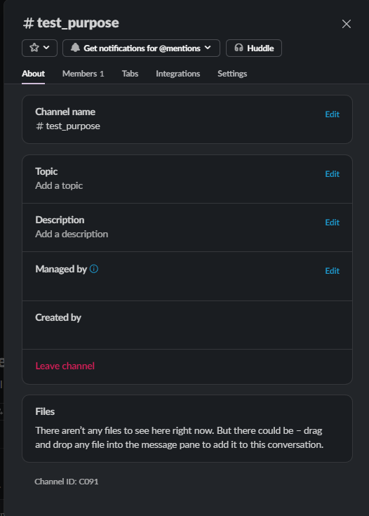

# Slack Bot Integration for Alert Messaging

This document outlines the concise steps taken to configure and use a Slack bot for sending alert notifications via an HTTP API.

---

## 1. Create Slack App

1. Go to [Slack API Apps](https://api.slack.com/apps) and click **Create New App**.



2. Choose **From scratch**, give it a name, and select the workspace.
3. Navigate to **OAuth & Permissions**:

   * Add these **Bot Token Scopes**:

     * `chat:write`
     * `channels:read`
     * `users:read`
4. Click **Install to Workspace** and authorize the app.
5. Copy the **Bot User OAuth Token** (starts with `xoxb-...`).



---

## 2. Identify Slack Channel

1. Visit the desired channel in Slack.
2. Right-click > **View channel details** > **Copy Channel ID** (e.g., `C0925GUT03E`).





---

## 3. Create Node.js Express App

1. Setup project:

   ```bash
   mkdir slack-notifier && cd slack-notifier
   pnpm init -y
   pnpm add express dotenv
   ```

2. Create `.env` file:

   ```env
   SLACK_BOT_TOKEN=xoxb-...your_token...
   SLACK_CHANNEL_ID=C0925GUT03E
   ```

3. Create `index.js`:

   ````js
   import express from "express";
   import dotenv from "dotenv";
   import { sendToSlack } from "./slack.js";

   dotenv.config();
   const app = express();
   app.use(express.json());

   app.post("/notify", async (req, res) => {
     const { project, timestamp, sensors, min, max } = req.body;
     if (!project || !timestamp || !sensors || !min || !max) {
       return res.status(400).json({ error: "Missing fields" });
     }

     const nullSensors = Object.entries(sensors)
       .filter(([, v]) => v === null || v === "na")
       .map(([k]) => k);

     const nullSection = `*\u{1F6A8} Alert Notification*\n\n` +
       `Device *${project}* has missing values for sensors at *${timestamp}*:\n\n` +
       nullSensors.map(s => `- ${s}`).join("\n") +
       `\n\nPlease check the device.\n\n_Thank you._`;

     const allSensorTable =
       "```Sensor   | Min     | Max\n" +
       "-----------------------------\n" +
       Object.keys(min).map(key => `${key.padEnd(8)} | ${min[key] ?? "-"}     | ${max[key] ?? "-"}`).join("\n") + "```";

     try {
       await sendToSlack(process.env.SLACK_BOT_TOKEN, process.env.SLACK_CHANNEL_ID, `${nullSection}\n\n${allSensorTable}`);
       res.json({ ok: true });
     } catch (err) {
       res.status(500).json({ error: err.message });
     }
   });

   app.listen(5000, () => console.log("Server running on port 5000"));
   ````

4. Create `slack.js`:

   ```js
   export async function sendToSlack(token, channel, text) {
     const res = await fetch("https://slack.com/api/chat.postMessage", {
       method: "POST",
       headers: {
         "Content-Type": "application/json",
         Authorization: `Bearer ${token}`
       },
       body: JSON.stringify({ channel, text })
     });
     const data = await res.json();
     if (!data.ok) throw new Error(data.error);
   }
   ```

> 📸 Place image showing working message in Slack channel

---

## 4. Get User List from Slack

1. Use `users.list` API to fetch users:

   ```js
   async function getSlackUsers() {
     const res = await fetch("https://slack.com/api/users.list", {
       method: "GET",
       headers: {
         "Content-Type": "application/x-www-form-urlencoded",
         Authorization: `Bearer ${process.env.SLACK_BOT_TOKEN}`
       }
     });
     const data = await res.json();
     return data.members;
   }
   ```

---

## ✅ Summary

* Slack App created and configured with proper scopes.
* Express app receives JSON data and posts alerts to Slack.
* Null sensor alerts formatted professionally.
* User list available for lookup/mentions if needed.

> 📸 final architecture screenshot will be placed here soon....

---

Let me know if you want this exported to PDF or styled in Obsidian format with collapsibles or callouts.
