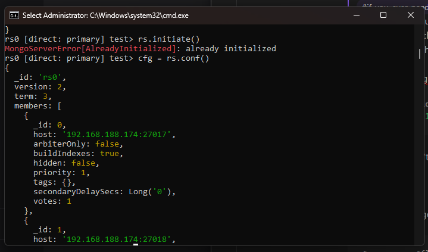
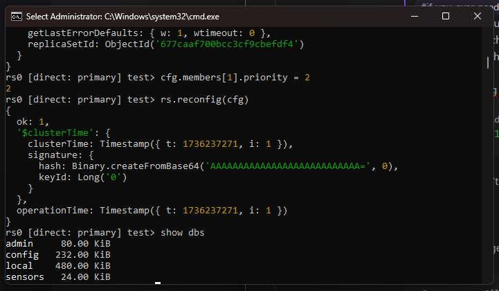
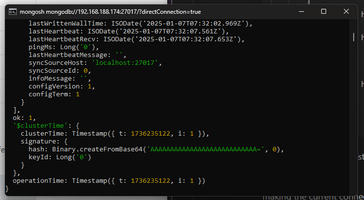

# How to Reconfigure MongoDB Replica Set (A Handy Guide)

So, let’s say you want to reconfigure your MongoDB replica set. You might think, "Oh, I'll just run `rs.initiate()` again with some updated values!" Nope. That won’t work. Here's how you actually do it.

---

## Viewing the Current Configuration

If you want to see your current configuration, type this:

```bash
rs.conf()
```

This will return your replica set configuration. Now, even if you try to initiate a new one (empty or with some object values) using `rs.initiate()`, it won’t let you overwrite the existing configuration. You'll need to reconfigure it properly.

---

## Step-by-Step Reconfiguration

1. **Start with `rs.conf()`**  
    Run the following command to grab the current configuration and assign it to a variable:
    
    ```bash
    cfg = rs.conf()
    ```
	
	
	
    This `cfg` variable will now hold your current replica set config.
    
2. **Modify the Configuration**  
    Let’s say you want to adjust the priority of one of your members. You can modify the config like this:
    
    ```bash
    cfg.members[1].priority = 2
    ```
	
	
	
    Feel free to make other adjustments here as needed.
    
3. **Rewriting the Configuration**  
    If you prefer starting fresh or making direct changes, you can also reconfigure like this:
    
    ```bash
    rs.reconfig({ 
        _id: "rs0", 
        members: [
            { _id: 0, host: "192.168.188.174:27017" },
            { _id: 1, host: "192.168.188.174:27018" },
            { _id: 2, host: "192.168.188.174:27019" }
        ]
    })
    ```
    
    However, if the replica set is already initialized, this might throw an `[AlreadyInitialized]` error.
	
	
	
4. **Apply the Changes**  
    Now, reapply your modified config using:
    
    ```bash
    rs.reconfig(cfg)
    ```
    
    Once you run this, you should get an `ok` response, meaning your replica set has been successfully reconfigured. 🎉
    
5. **Reconnect to the Instances**  
    After reconfiguring, make sure to restart your MongoDB instances. Then, connect using the reconfigured hostnames.
    

---

## Quick Tip: Connect MongoDB in WSL Using IP Address

Here’s a little workaround I found that might help you if you’re like me—running all your development in WSL while your MongoDB instance lives on Windows.

Instead of using `localhost` in your MongoDB URI, just use your Windows IP address. To get it, open up **Command Prompt** and type:

```bash
ipconfig
```

Copy your IP address and replace `localhost` in your MongoDB connection string with it. This way, you can bind MongoDB from any **IP** you want and seamlessly connect from WSL.

---

Hope this little roundabout trick makes your life easier! 🚀