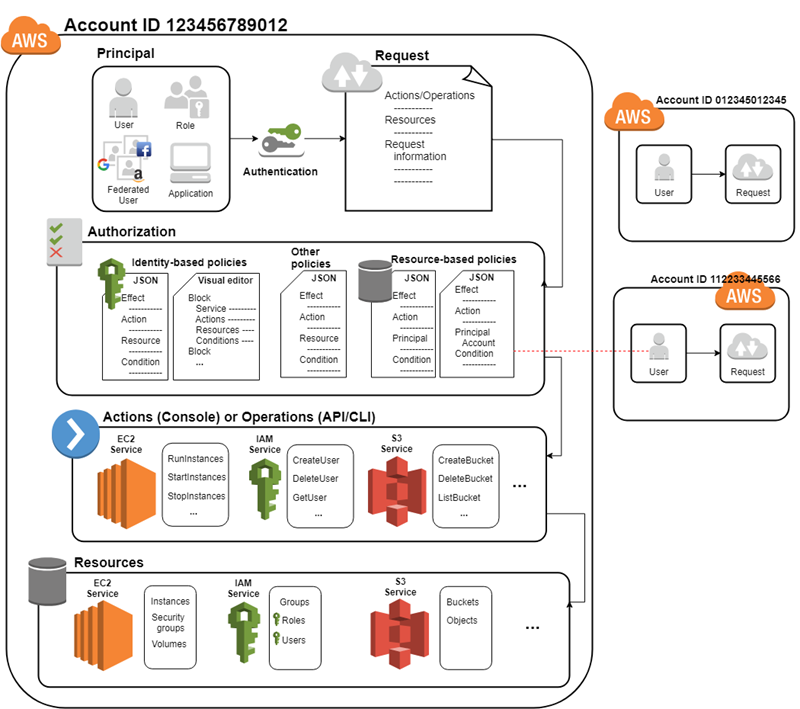
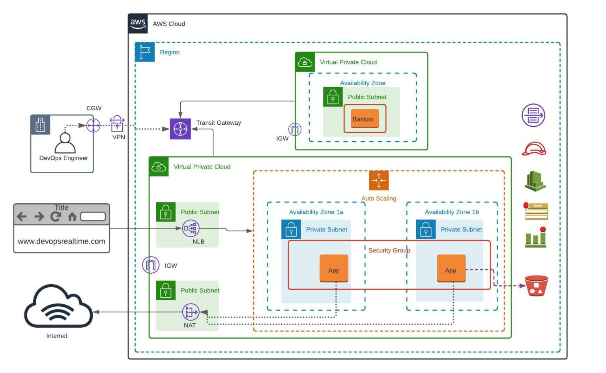
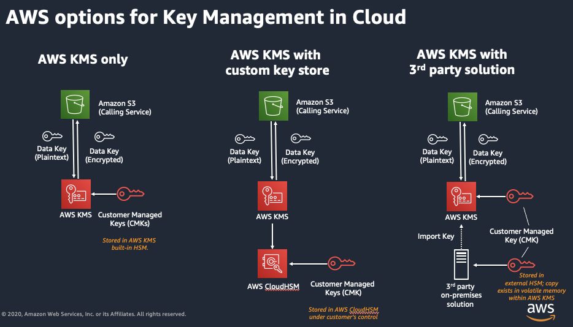
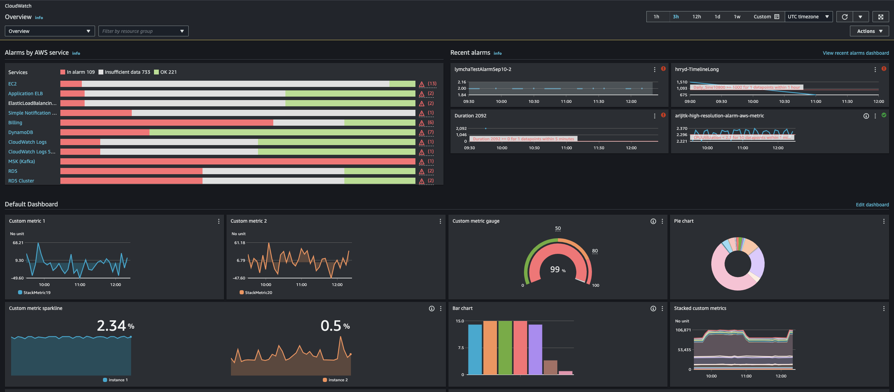

# How to Implement Cloud Security in AWS

Follow these practical steps to build and maintain a secure AWS environment.

---

## Step 1: Identity and Access Management (IAM)

- Create individual IAM users—not shared root access.
- Organize permissions using IAM groups.
- Apply least privilege design.
- Require MFA for all accounts.
- Conduct regular permission reviews and cleanups.

**Reference:**  

---

## Step 2: Secure Network Architecture

- Use **Amazon VPC** for private isolation.
- Implement segmentation using:
  - Public subnets for web interfaces
  - Private subnets for databases
  - Backend subnets for processing
- Secure traffic with Security Groups and NACLs.
- Protect applications with **AWS WAF**.

**Reference:**  

---

## Step 3: Data Protection & Encryption

- Encrypt data at rest (EBS, S3) using **AWS KMS**.
- Prefer Customer Managed Keys (CMKs).
- Rotate encryption keys regularly.
- Encrypt data in transit (TLS/SSL).
- Implement backups and test recovery.

**Reference:**  

---

## Step 4: Monitoring & Logging

- Activate **AWS CloudTrail** for API activity tracking.
- Use **Amazon CloudWatch** for metrics and alarms.
- Enable **AWS Config** for configuration drift tracking.
- Centralize logs and analyze with SIEM tools.
- Alert on suspicious behavior.

**Reference:**  

---

## Step 5: Threat Detection & Prevention

- Enable **AWS Shield** for DDoS protection.
- Use **AWS GuardDuty** for threat intelligence.
- Consider IDPS tooling for deeper defense.

---

## Step 6: Patch Management

- Maintain current OS and application patches.
- Automate patching with AWS Systems Manager.
- Regularly perform vulnerability scans.

---

## Step 7: Compliance & Governance

- Map your setup to compliance standards (e.g., ISO 27001, HIPAA, PCI-DSS).
- Audit configurations continuously.
- Retrieve compliance reports via **AWS Artifact**.

---

## Quick Security Checklist

| Area           | Best Practice                                        |
| -------------- | ---------------------------------------------------- |
| **IAM**        | MFA, least privilege, group-based access             |
| **Network**    | Segmentation, Security Groups, NACLs, VPC setup      |
| **Data**       | Encryption (rest & transit), KMS, periodic rotations |
| **Monitoring** | CloudTrail, CloudWatch, SIEM, alerting               |
| **Threats**    | WAF, Shield, GuardDuty, IDS/IPS                      |
| **Patching**   | Automation, regular scans                            |
| **Compliance** | Audits, control mapping, AWS Artifact                |

---

## References

- [AWS Shared Responsibility Model](https://aws.amazon.com/compliance/shared-responsibility-model/) :contentReference[oaicite:0]{index=0}
- [AWS Well-Architected Security Pillar](https://docs.aws.amazon.com/wellarchitected/latest/security-pillar/shared-responsibility.html) :contentReference[oaicite:1]{index=1}
- [Shared responsibility overview (DevOps AWS)](https://docs.aws.amazon.com/whitepapers/latest/introduction-devops-aws/shared-responsibility.html) :contentReference[oaicite:2]{index=2}
